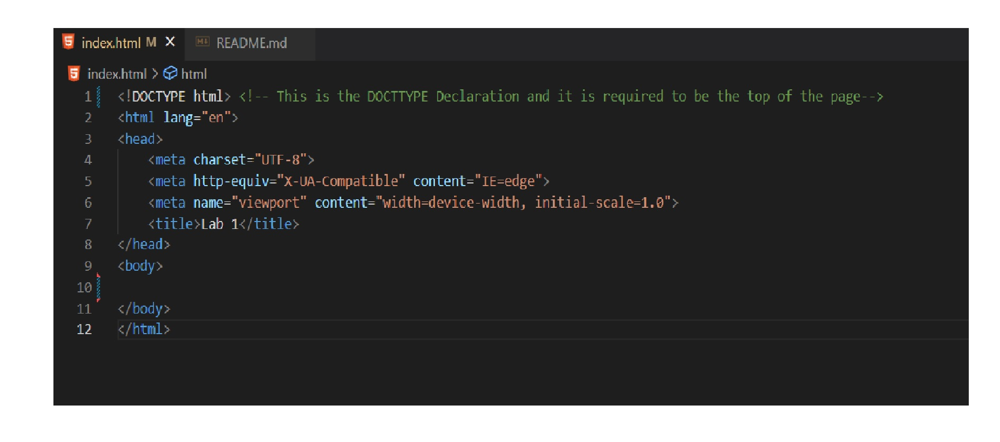

# CSI140_Lab_1

Section A: Add a comment at the end of each tag identifying what the tag is and include any attributes if applicable.

Section B: In the body of the html document recreate the context from the image below. The wording in the paragraphs do not have to be exact. But you must have the same amount of lines.

